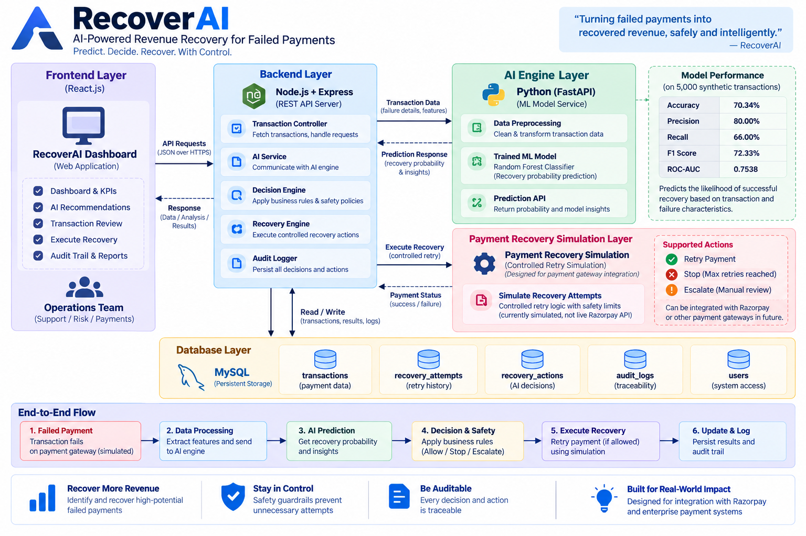
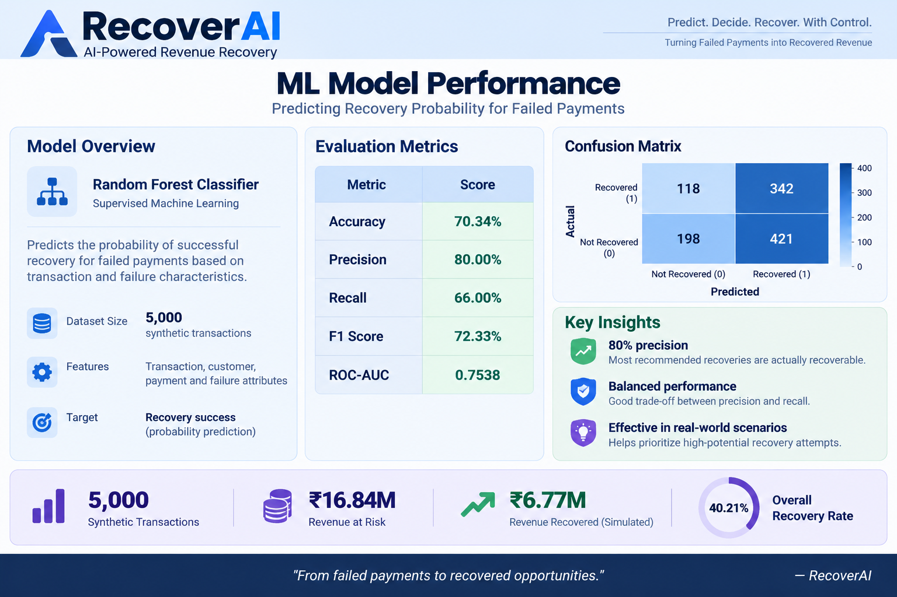

# RecoverAI — AI-Powered Revenue Recovery

> **AI Revenue Recovery | Razorpay AI Buildathon**

RecoverAI is an AI-powered revenue recovery platform designed to identify failed or at-risk payment transactions, estimate their probability of successful recovery, recommend the most appropriate intervention, and execute only policy-compliant recovery actions.

**Core principle: ** **AI predicts. Policy decides. Safety controls execution. Every action is auditable.**

RecoverAI connects **risk prediction → decisioning → safety guardrails → controlled recovery → measurable outcomes → auditability** into one operational workflow.

----------------------------------------------------------------------------------------------------------------------------------

## 1. Problem Statement

Payment failures expose businesses to revenue leakage. A failed transaction does not necessarily mean that the underlying revenue is permanently lost.

Different failure conditions require different interventions:

- Temporary bank failures may be suitable for an automated retry.
- Moderate recovery opportunities may require customer notification.
- Low-probability cases may need manual escalation.
- Transactions that have exhausted retry limits should be stopped.

A naive recovery system can cause:

1. **Under-recovery** — valuable transactions are abandoned even when recovery is likely.
2. **Over-recovery** — transactions are repeatedly retried without sufficient safeguards.

RecoverAI addresses this by combining machine-learning predictions with deterministic business rules and safety constraints.

----------------------------------------------------------------------------------------------------------------------------------

## 2. Solution Overview

RecoverAI evaluates a failed transaction through a controlled recovery pipeline:

```text
Failed / At-Risk Transaction
            ↓
Transaction & Customer Data
            ↓
Python ML Engine
            ↓
Recovery Probability
            ↓
Node.js Decision Engine
            ↓
Safety & Policy Checks
            ↓
┌───────────┬───────────┬────────────┐
│   RETRY   │  NOTIFY   │  ESCALATE  │
└───────────┴───────────┴────────────┘
                    or
                   STOP
                    ↓
        Controlled Recovery Workflow
                    ↓
       Database State + Recovery Result
                    ↓
              Audit Trail


The ML model does **not** directly execute a recovery action. Model output is treated as a signal; the backend decision and safety layer remains the enforcement boundary.

----------------------------------------------------------------------------------------------------------------------------------

## 3. Key Capabilities

### AI-Based Recovery Prediction
Predicts the probability that a failed payment can be successfully recovered.

### Policy-Based Decisioning
Converts the prediction and transaction context into a recommended recovery action.

### Safety Guardrails
Prevents unsafe automation, including repeated retries after the configured maximum retry limit.

### Controlled Recovery Workflow
Executes an allowed recovery action and persists the resulting transaction and recovery state.

### Revenue Measurement
Tracks revenue at risk, recovered revenue, recovery rate, recovery attempts, and workflow outcomes.

### AI Recovery Queue
Prioritizes transactions requiring attention so operators can focus on the most relevant cases.

### Complete Audit Trail
Records recovery decisions and executions for traceability and operational review.

### Transaction-Level AI Analysis
Provides recovery probability, recommended action, failure analysis, and safety information for individual transactions.

----------------------------------------------------------------------------------------------------------------------------------

# 4. System Architecture

The following architecture represents the implemented RecoverAI system and its separation of responsibilities.



### Architecture Layers

Frontend: React.js. Manages the operations dashboard, transaction analysis, AI queue, recovery actions, and monitoring.Backend: Node.js + Express.js. Handles the API layer, orchestration, decision engine, recovery workflow, and audit logging.
AI Engine: Python + FastAPI. Powers ML inference and recovery probability prediction.
Database: MySQL. Stores transactions, customers, recovery actions, recovery attempts, users, and audit logs.
Recovery Layer: Controlled Simulation. Demonstrates bounded payment recovery actions and outcomes.

### End-to-End Flow

1. A failed transaction is loaded by the backend.
2. Transaction and customer context is prepared for inference.
3. The Node.js AI service calls the Python FastAPI prediction endpoint.
4. The Random Forest model returns a recovery probability.
5. The Node.js decision engine evaluates probability and failure type.
6. The safety engine checks retry limits and automation eligibility.
7. An allowed action is executed through the controlled recovery workflow.
8. Transaction and recovery state are persisted in MySQL.
9. The decision and execution are written to the audit trail.

----------------------------------------------------------------------------------------------------------------------------------

# 5. AI / ML Approach

RecoverAI uses a **Random Forest Classifier** to estimate the probability of successful payment recovery.



### Model Objective

**Target:** Recovery success

The model learns from transaction-level attributes to distinguish transactions that are more likely to be successfully recovered from those that are less likely to recover.

### Demonstration Dataset

- **Dataset size:** 5,000 synthetic transactions
- **Observed outcomes:** 3,404 transactions with recovery outcomes
- **Successful recoveries:** 2,000
- **Failed recovery outcomes:** 1,404
- **Train/Test split:** 2,723 / 681 observed transactions

### Model Performance

Accuracy: 70.34%
Precision: 80.00%
Recall: 66.00%
F1 Score: 72.33%
ROC-AUC: 0.7538

These metrics are from the project's **synthetic demonstration dataset** and are not production Razorpay performance.

### Feature Context

The prediction pipeline uses transaction and customer/payment context, including:

- Transaction amount
- Payment method
- Failure code
- Retry count
- Customer historical success rate

The model produces a recovery probability that is subsequently evaluated by the backend decision and safety layer.

----------------------------------------------------------------------------------------------------------------------------------

# 6. AI Decision & Safety Engine

A central architectural principle of RecoverAI is the separation between **prediction** and **execution**.


                ML MODEL
                   │
                   ▼
          Recovery Probability
                   │
                   ▼
          ┌─────────────────┐
          │ Decision Engine  │
          └────────┬────────┘
                   │
                   ▼
          ┌─────────────────┐
          │ Safety Engine    │
          │                 │
          │ Retry Limit     │
          │ Failure Type    │
          │ Automation Rule │
          └────────┬────────┘
                   │
          ┌────────┴─────────┐
          ▼                  ▼
       ALLOWED             BLOCKED
          │                  │
          ▼                  ▼
       EXECUTE              STOP /
       RECOVERY             NOTIFY /
                            ESCALATE


### Decision Policy

| Condition | Action | Automation |
|---|---|---|
| Retry limit reached | STOP | Blocked |
| Probability ≥ 70% + temporary bank failure | RETRY | Allowed |
| Probability ≥ 50% | NOTIFY | Controlled follow-up |
| Probability < 50% | ESCALATE | Manual review |

The retry limit is currently **2 attempts**.

A high model probability cannot bypass deterministic safety constraints.

### Example Safety Override

Recovery Probability: 78.24%
Recommended Action: STOP
Retry Count: 2 / 2

Reason:
Maximum retry limit reached.
Automated recovery is blocked to prevent repeated payment attempts.

-------------------------------------------------------------------------------------------------------------------------------

# 7. Recovery Workflow

```text
FAILED
  │
  ▼
AI ANALYSIS
  │
  ▼
RECOVERY DECISION
  │
  ├── RETRY
  ├── NOTIFY
  ├── ESCALATE
  └── STOP
        │
        ▼
CONTROLLED ACTION
        │
   ┌────┴────┐
   ▼         ▼
RECOVERED  FAILED
   │
   ▼
AUDIT + METRICS
```

For an automated retry:

1. AI inference is requested.
2. Recovery probability is calculated.
3. Decision rules select the recommended action.
4. Safety checks determine whether automation is permitted.
5. The controlled recovery workflow executes the action.
6. The transaction is updated.
7. Recovery attempt and action records are created.
8. An audit event is persisted.

-------------------------------------------------------------------------------------------------------------------------------------

# 8. Revenue & Recovery Metrics

RecoverAI measures recovery as an operational business outcome rather than treating prediction accuracy as the only success metric.

### Demonstration Results (Metric - Result)

Transactions: 5,000
Revenue at Risk: ₹16.84M
Revenue Recovered: ₹6.77M
Overall Recovery Rate: 40.21%
Successful Recovery Outcomes: 2,000
Failed Recovery Outcomes: 1,404
Not Attempted: 1,596

### Action-Level Results

RETRY: 1,353 transactions, 1,111 successful (82.11% recovery rate)
NOTIFY: 424 transactions, 266 successful (62.74% recovery rate)
ESCALATE: 1,627 transactions, 623 successful (38.29% recovery rate)
STOP: 1,596 transactions, 0 successful (—)

> These are results from the project's synthetic demonstration and controlled recovery simulation.

-------------------------------------------------------------------------------------------------------------------------------------

# 9. Dashboard

The RecoverAI operations dashboard provides a centralized view of the recovery pipeline.

It provides:

- Revenue at Risk
- Revenue Recovered
- Recovery Rate
- Recovery Attempts
- Transactions Requiring Attention
- AI Recommendation
- AI Recovery Queue
- Recent Recovery Activity
- Audit Trail
- Transaction-level AI analysis

The operator workflow is:

```text
Monitor → Prioritize → Analyze → Execute → Verify → Audit
```

---

# 10. Auditability

Every important recovery event is persisted for traceability.

The audit layer captures:

- Transaction reference
- Event type
- Event description
- Actor
- Timestamp
- Recovery result

Example events include:

```text
RECOVERY_BLOCKED
RECOVERY_EXECUTED
```

This creates a persistent trail from the failed transaction through AI analysis, policy decision, recovery execution, and final outcome.

-------------------------------------------------------------------------------------------------------------------------------------

# 11. Database Design

RecoverAI uses MySQL for persistent operational data.

### Core Tables

```text
users
customers
transactions
recovery_actions
recovery_attempts
audit_logs
```

### Transaction

Stores:

- Transaction reference
- Customer
- Amount
- Payment method
- Status
- Failure code/reason
- Retry count
- Recovery probability
- AI recommendation
- Creation timestamp

### Recovery Actions

Stores the selected action:

```text
RETRY
NOTIFY
ESCALATE
STOP
```

### Recovery Attempts

Stores:

- Attempt number
- Action type
- Status
- Amount recovered
- Attempt timestamp

### Audit Logs

Stores operational events for traceability and review.

---

# 12. API Architecture

### Health

```http
GET /api/health
```

### Transactions

```http
GET /api/transactions
GET /api/transactions/:id
GET /api/transactions/:id/analyze
```

### AI Analysis

```http
POST /api/ai/analyze
```

### Recovery

```http
POST /api/transactions/:id/recover
```

### Dashboard

```http
GET /api/dashboard/overview
GET /api/dashboard/recent-actions
GET /api/dashboard/audit-logs
```

### AI Engine

```http
POST /predict
```

The Python FastAPI service exposes interactive Swagger documentation at:

```text
http://localhost:8000/docs
```

-------------------------------------------------------------------------------------------------------------------------------------

# 13. Technology Stack

Frontend: React.js, Vite
UI / Styling: Tailwind CSS
Data Visualization: Recharts
Icons: Lucide React
Animations: Framer Motion
HTTP Client: Axios
Backend: Node.js, Express.js
AI / ML: Python, Scikit-learn
ML Model: Random Forest Classifier
AI API: FastAPI
Database: MySQL 8
API Testing: Postman
Development: VS Code
Version Control: Git, GitHub

-------------------------------------------------------------------------------------------------------------------------------------

# 14. Project Structure

```text
recover-ai/
│
├── frontend/
│   ├── src/
│   ├── public/
│   ├── package.json
│   └── vite.config.js
│
├── backend/
│   ├── controllers/
│   ├── routes/
│   ├── services/
│   ├── database/
│   ├── server.js
│   └── package.json
│
├── ai-engine/
│   ├── model/
│   ├── data/
│   ├── main.py
│   ├── requirements.txt
│   └── ...
│
├── database/
│   └── ...
│
├── docs/
│   ├── system-architecture.png
│   └── ml-results.png
│
├── .gitignore
└── README.md
```

> Adjust inner file names if your final local project structure differs.

-------------------------------------------------------------------------------------------------------------------------------------

# 15. Local Setup

## Prerequisites

- Node.js 18+
- Python 3.10+
- MySQL 8+
- Git

## Clone

```bash
git clone <YOUR_GITHUB_REPOSITORY_URL>
cd recover-ai
```

## Database

```sql
CREATE DATABASE recover_ai;
```

Run the SQL schema/data script in the `database/` directory.

Create a local `.env` file for backend credentials:

```env
DB_HOST=localhost
DB_USER=root
DB_PASSWORD=YOUR_PASSWORD
DB_NAME=recover_ai
PORT=5000
```

**Never commit `.env` or database credentials to GitHub.**

## AI Engine

```bash
cd ai-engine
python -m venv venv
```

Windows:

```bash
venv\Scripts\activate
```

```bash
pip install -r requirements.txt
uvicorn main:app --reload --port 8000
```

AI service:

```text
http://localhost:8000
```

Swagger:

```text
http://localhost:8000/docs
```

## Backend

```bash
cd backend
npm install
npm start
```

Backend:

```text
http://localhost:5000
```

Health check:

```text
http://localhost:5000/api/health
```

## Frontend

```bash
cd frontend
npm install
npm run dev
```

Open the Vite URL shown in the terminal, typically:

```text
http://localhost:5173
```

-------------------------------------------------------------------------------------------------------------------------------------

# 16. End-to-End Demonstration

### Scenario 1 — Successful Automated Recovery

```text
TXN-DEMO-RECOVER
        ↓
Bank Timeout
        ↓
AI Prediction
        ↓
79.53% Recovery Probability
        ↓
RETRY
        ↓
Safety Check: Allowed
        ↓
Controlled Recovery
        ↓
RECOVERED
        ↓
Database + Audit Trail Updated
```

### Scenario 2 — Safety Override

```text
TXN-1096
        ↓
Bank Error
        ↓
78.24% Recovery Probability
        ↓
Retry Count: 2 / 2
        ↓
Safety Engine
        ↓
STOP
        ↓
Automated Recovery Blocked
```

The second scenario demonstrates that RecoverAI does not blindly execute a high-confidence model prediction.

-------------------------------------------------------------------------------------------------------------------------------------

# 17. Demo Video

A product demonstration accompanies the project submission.

**Video filename:** `RecoverAI_AI_Revenue_Recovery_Demo.mp4`

Recommended repository location if the file is small enough:

```text
docs/demo/RecoverAI_AI_Revenue_Recovery_Demo.mp4
```

If the video is hosted externally, replace the placeholder below:

```text
[▶ Watch the RecoverAI Demo](https://drive.google.com/file/d/18uwSPIXzokeS1BfITFzu8G1-2viVMj8G/view?usp=drive_link)
```

The demonstration covers:

- Revenue recovery problem
- RecoverAI architecture
- Operations dashboard
- AI Recovery Queue
- Transaction-level AI analysis
- Controlled automated recovery
- Safety override
- Recovery activity
- Audit trail
- ML performance

-------------------------------------------------------------------------------------------------------------------------------------

# 18. Why RecoverAI Fits AI Revenue Recovery

RecoverAI is designed around the complete revenue recovery lifecycle rather than isolated prediction.

```text
                  REVENUE AT RISK
                         │
                         ▼
                AI RISK ASSESSMENT
                         │
                         ▼
                 INTERVENTION
                    DECISION
                         │
                         ▼
               SAFETY / POLICY
                    CONTROLS
                         │
                         ▼
               CONTROLLED ACTION
                         │
                         ▼
             RECOVERY OUTCOME
                         │
                         ▼
              REVENUE MEASUREMENT
                         │
                         ▼
                  AUDIT TRAIL
```

This architecture provides a foundation for extending the demonstration toward production payment recovery systems where external payment gateway APIs, richer customer behavior signals, experimentation, and enterprise policy controls can be integrated.

-------------------------------------------------------------------------------------------------------------------------------------

# 19. Future Scope

### Payment Gateway Integration
Replace the controlled recovery simulation with a production payment gateway integration such as Razorpay APIs, subject to API capabilities, authentication, and business controls.

### More Advanced Recovery Strategies
- Smart retry scheduling
- Customer-specific recovery timing
- Payment-method optimization
- Notification personalization
- Escalation prioritization

### Model Improvement
- Gradient boosting models
- XGBoost / LightGBM
- Probability calibration
- Cost-sensitive learning
- Online model monitoring
- Model drift detection

### Experimentation
Measure recovery strategies using controlled experiments and compare incremental recovered revenue rather than relying only on aggregate recovery rate.

### Production-Grade Governance
- Configurable merchant policies
- Rate limits
- Idempotency controls
- Approval workflows
- Role-based access control
- Model versioning
- Explainability and monitoring
- Stronger observability

-------------------------------------------------------------------------------------------------------------------------------------

# 20. Project Impact

RecoverAI demonstrates how an AI system can optimize a business outcome while maintaining operational control.

The platform connects:

**Prediction → Decision → Safety → Action → Recovery → Measurement → Audit**

Instead of asking only:

> “Can this transaction recover?”

RecoverAI asks:

> **“Is this transaction worth recovering, what intervention should be used, and is that intervention safe to execute?”**

That distinction is the foundation of the system.

-------------------------------------------------------------------------------------------------------------------------------------

# 21. Buildathon Track

**Track:** AI Revenue Recovery

RecoverAI focuses on:

- Detecting revenue at risk
- Predicting recovery potential
- Selecting appropriate interventions
- Executing bounded recovery workflows
- Applying safety constraints
- Measuring recovered revenue
- Maintaining an auditable recovery trail

-------------------------------------------------------------------------------------------------------------------------------------

# 22. Disclaimer

RecoverAI is a **buildathon prototype and demonstration system**.

The dataset used for ML evaluation is synthetic, and the payment recovery workflow is implemented as a controlled simulation. No production Razorpay transaction data or live payment recovery operation is represented by the demonstration metrics.

The architecture is intentionally designed so that the simulation layer can be replaced with an appropriately authenticated and policy-controlled payment gateway integration in a production implementation.

-------------------------------------------------------------------------------------------------------------------------------------

# 23. Team

**RecoverAI**

Built for the **Razorpay AI Buildathon — AI Revenue Recovery** track.


